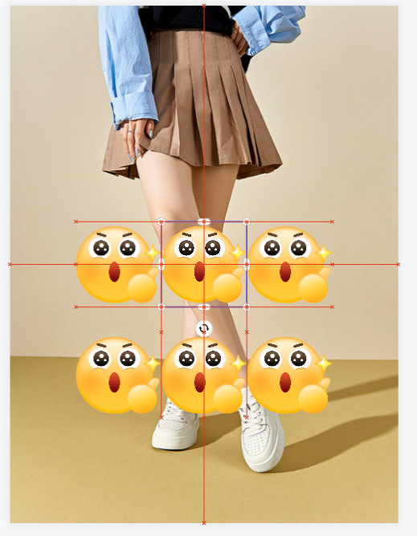
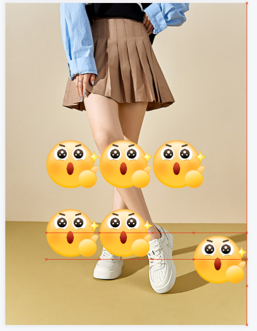
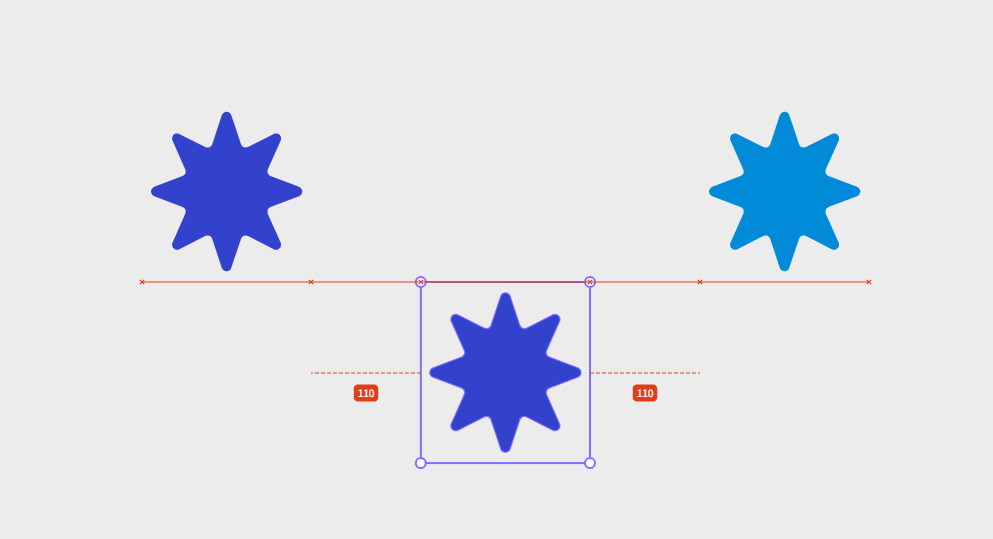
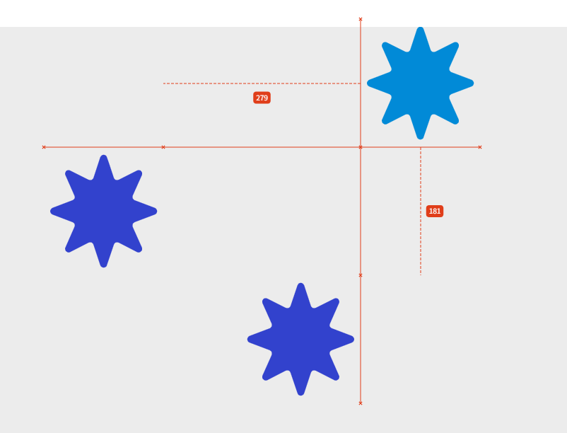
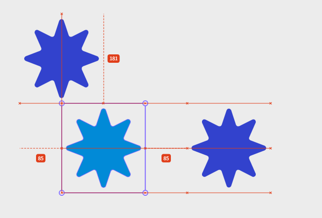

# leafer-x-easy-snap

[![npm version][npm-version-src]][npm-version-href]
[![npm downloads][npm-downloads-src]][npm-downloads-href]
[![bundle][bundle-src]][bundle-href]
[![License][license-src]][license-href]

吸附插件，为 Leafer 应用提供元素移动自动吸附、对齐辅助线功能

### 安装

```bash
npm i leafer-x-easy-snap
```

### 快速使用

```ts
import { Snap } from 'leafer-x-easy-snap'

const app = new App({
  view: window,
  editor: {}
})

const snap = new Snap(app)

// 启用
snap.enable(true)
```

### 更多使用方式请移步 【[playground](playground/src/main.ts)】

### 项目参考自：【[leafer-x-snap](https://github.com/tuntun0609/leafer-x-snap)】

### 配置

```typescript
/**
 * Snap 配置接口
 * 定义吸附功能的各种配置选项
 */
export interface SnapConfig {
  /** 基于哪个容器计算吸附元素，默认为 app.tree */
  parentContainer?: IUI
  /** 是否只对视口内元素进行吸附，默认为 true */
  viewportOnly?: boolean
  /** 自定义过滤规则，用于排除特定元素 */
  filter?: (element: IUI) => boolean
  /** 是否显示吸附线，默认为 true */
  showLine?: boolean
  /** 是否显示吸附点标记，默认为 true */
  showLinePoints?: boolean
  /** 是否显示距离标签，默认为 true */
  showDistanceLabels?: boolean
  /** 吸附范围（像素），默认为 5 */
  snapSize?: number
  /** 吸附线颜色，默认为 '#E03E1A' */
  lineColor?: string
  /** 吸附点标记尺寸，默认为 4 */
  pointSize?: number
  /** 吸附线宽度，默认为 1 */
  strokeWidth?: number
  /** 吸附线虚线样式，默认为 null（实线） */
  dashPattern?: number[]
  /** 距离标签样式，包含线、框和文本样式 */
  distanceLabelStyle?: {
    line?: Partial<ILine>
    box?: Partial<IBox>
    text?: Partial<IText>
  }
}
```

### 特点

1. 绘制对齐辅助线的策略变更：基于移动元素 x、y 轴各生成最多3条线，绘制时会显示所有在线上的点
2. 基于 `parentContainer` 查找兄弟元素进行吸附，含`parentContainer`
3. 支持通过`updateConfig` 方法动态修改配置，如：更新父容器
4. 支持 ⌨️ 上下左右 按键微调时显示辅助线
5. 可以在元素上设置 `isSnap` 属性来控制元素是否参与吸附计算，默认为 `true`
6. 支持通过`showDistanceLabels`开启距离标签显示
7. 可通过 `distanceLabelStyle` 自定义距离标签样式：线、框和文本

### 截图示例

* 吸附线基础：X、Y轴各最多3条辅助线，支持指定父容器例如：Frame，父容器 `isLeafer`属性为`false` 时参与吸附计算如下图。
    * 
    * 

* 取显示的吸附线中，距离元素最近的点，从边的中线创建距离指示线，并创建距离标签。（两侧距离都一致时显示2个距离标签）
    * 
    * 
    * 
    * 

## License

[MIT](./LICENSE) License © 2024-PRESENT [XiaDeYu](https://github.com/Xdy1579883916)

[MIT](https://github.com/tuntun0609/leafer-x-snap/blob/master/LICENSE) License ©
2024-PRESENT [tuntun0609](https://github.com/tuntun0609)

<!-- Badges -->

[npm-version-src]: https://img.shields.io/npm/v/leafer-x-easy-snap?style=flat&colorA=080f12&colorB=1fa669

[npm-version-href]: https://npmjs.com/package/leafer-x-easy-snap

[npm-downloads-src]: https://img.shields.io/npm/dm/leafer-x-easy-snap?style=flat&colorA=080f12&colorB=1fa669

[npm-downloads-href]: https://npmjs.com/package/leafer-x-easy-snap

[bundle-src]: https://img.shields.io/bundlephobia/minzip/leafer-x-easy-snap?style=flat&colorA=080f12&colorB=1fa669&label=minzip

[bundle-href]: https://bundlephobia.com/result?p=leafer-x-easy-snap

[license-src]: https://img.shields.io/github/license/Xdy1579883916/leafer-x-easy-snap.svg?style=flat&colorA=080f12&colorB=1fa669

[license-href]: https://github.com/Xdy1579883916/leafer-x-easy-snap/blob/main/LICENSE
